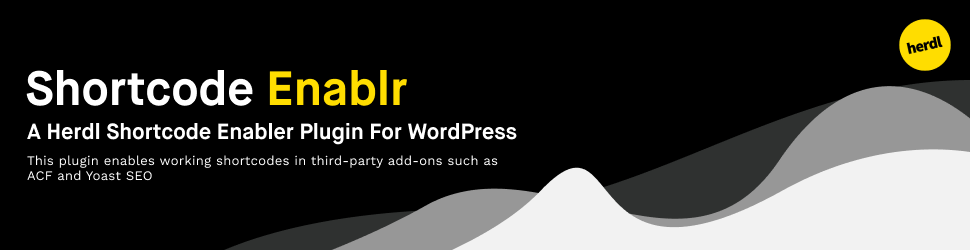

[](https://github.com/herdl/shortcode-enablr)
[](https://github.com/herdl/shortcode-enablr/graphs/commit-activity)
[](https://github.com/herdl/shortcode-enablr/releases/)
[](http://makeapullrequest.com)
[](https://github.com/herdl)

# Shortcode Enablr
WordPress third-party shortcode enabler.

## Prerequisites
The following is a list of prerequisites for Shortcode Enablr.
```
PHP Version >= 7.0.0
```

### Installation

You can download the latest release as a `.zip` then head over to your site to install this manually.

Alternatively, you can install it via the [WordPress marketplace](https://wordpress.org/plugins/shortcode-enablr/).

## Description

The Herdl third-party shortcode enabler plugin, shortcode-enablr, allows for shortcode to be used in third-party add-ons such as ACF and Yoast SEO.

## Usage

To add shortcode to the desired add-on, navigate the shortcode-enablr settings and select the service you want to enable shortcode for. Hit save and all is done!

## FAQ

Q - I want to use shortcode in an add-on that isn't currently listed, can I request it?
A - Sure! 

## We're Using
* [PHP](https://www.php.net/) - The primary programming language

## Contributing
It is worth noting that all contributions must comply with the [PSR-2 standards](https://github.com/php-fig/fig-standards/blob/master/accepted/PSR-2-coding-style-guide.md)

## Versioning
We use [SemVer](http://semver.org/) for versioning. For the versions available, see the [tags on this repository](https://github.com/herdl/shortcode-enablr/tags). 

## Authors
* **Alex Blackham** - *Developer and Maintainer* - [B3none](https://github.com/b3none)
* **Mat Moses** - *Logo creation* - [mooonthemove](https://instagram.com/mooonthemove)

See also the list of [contributors](https://github.com/herdl/shortcode-enablr/contributors) who participated in this project.

## License
This project is licensed under the MIT License - see the [LICENSE.md](LICENSE.md) file for details
